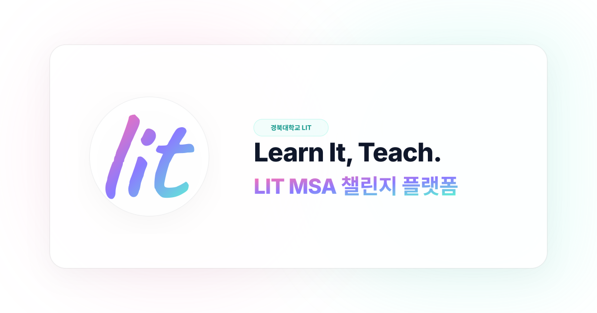

# ⚡ LIT MSA 챌린지 (LIT KNU Platform)

<p align="center">
  
</p>

<p align="center">
  <strong>경북대학교 IT 기술 발표 동아리 LIT의 Microsoft Student Ambassadors (MSA) 공식 챌린지 웹 플랫폼</strong>
</p>

<p align="center">
  
  
  
  
  
  
  
  
</p>

---

## 📖 프로젝트 소개 (About the Project)

**LIT MSA 챌린지** 웹사이트는 경북대학교 IT 기술 발표 동아리 **LIT(Learn It, Teach)** 부원들이 **Microsoft Student Ambassadors (Community Influencer / Preferred Visitors)** 활동을 효과적으로 수행하고, 상호 동기부여를 얻을 수 있도록 설계된 실시간 대시보드 및 커뮤니티 플랫폼입니다.

토스(Toss)와 애플(Apple) 스타일의 정교한 인터랙션 디자인, 부드러운 관성 스크롤(Lenis), 반응형 모바일 최적화, 그리고 Azure 클라우드 서버리스 NoSQL 아키텍처를 기반으로 개발되었습니다.

---

## ✨ 핵심 기능 (Key Features)

### 1. 🏆 실시간 챌린지 대시보드 & 리더보드
- **실시간 클릭수 순위 집계**: 부원들의 MS Learn 활동 클릭수(Preferred Visitors)를 실시간으로 집계 및 시각화.
- **Top 3 하이라이트 & 티어 시스템**: 1위(Crown), 2위, 3위 입상자 전용 글로우 이펙트 및 달성 마일스톤 배지 표시.
- **부원 빠른 검색 & 필터**: 학부/전공, 이름, 아이디 실시간 검색 및 필터링.

### 2. 🔗 MS Learn Contributor 링크 자동 생성기
- 부원의 Contributor ID(예: `studentamb_482865` 또는 `482865`)를 입력하면 클릭수 집계용 공식 파라미터(`?wt.mc_id=...`)가 포함된 링크를 원클릭으로 자동 생성.
- 원본 URL과 상관없이 올바른 트래킹 코드가 자동으로 결합되어 간편하게 공유 가능.

### 3. 🤖 AI 기반 클릭수 증빙 자동 검증 (Gemini Multimodal Vision)
- 마이크로소프트 공식 통계 메일 캡처본(Preferred Visitors) 업로드 시 Gemini AI가 화면을 정밀 판독.
- 공식 발송 메일 여부, 활동 수치, 메일 제목 및 일자를 자동 추출하여 감사 로그에 기록 및 클릭수 즉시 반영.

### 4. 📰 아티클 허브 (Article Hub)
- **고화질 미디어 지원 피드**: 기술 블로그, LinkedIn 아티클 공유 시 최대 30MB 고화질 대표 이미지 첨부 지원 (Retina 1400px 자동 무손실 최적화).
- **작성자별 모아보기 & 태그 필터링**: 태그별, 작성자별 필터링 및 실시간 검색.
- **안전한 추천 링크 연동**: Contributor 트래킹 링크 및 원문 링크 자동 연결, XSS 방지 URL 프로토콜 안전 검증 탑재.

### 5. 👤 상세 부원 프로필 & 명예의 전당
- **표준 미디어 파이프라인**: 최대 30MB 스마트폰/카메라 원본 프로필 사진 업로드 지원 (브라우저 비동기 360px 무손실 최적화).
- **부원별 보유 MS 자격증(AI-900, AZ-900 등)** 태그 칩 표시, 개인 기술 스택, 소개글, 아티클 모아보기 제공.

### 6. 🎨 토스 & 애플 감성의 듀얼 테마
- **사이버 다크 모드**: 오로라 블러 및 네온 글로우가 돋보이는 몰입형 디자인.
- **토스/애플 소프트 화이트 모드**: 눈이 편안한 스튜디오 화이트 배경, 부드러운 플로팅 글래스 카드, 자연스러운 그림자.
- 테마 전환 시 깜빡임(FOUC) 없는 인라인 런타임 테마 주입.

---

## 🏗️ 시스템 아키텍처 (Architecture)

```
[ Client (Browser / Mobile) ]
    │  React 19 + Vite 7 + Tailwind CSS 4 + Framer Motion + Lenis
    │  - ErrorBoundary (런타임 예외 복구 및 무중단 서빙)
    │  - safeSetItem (LocalStorage QuotaExceeded 자동 캐시 정리)
    │  - createImageBitmap (최대 30MB 고화질 미디어 초고속 클라이언트 압축)
    │  - Rollup Chunk Optimization (모바일 초기 로딩 고속화)
    │  - word-break: keep-all (모바일 한글 글꼴 잘림 방지)
    ▼
[ Hosting & CDN ]
    │  Azure Static Web Apps (Free Tier: 글로벌 Edge CDN + 자동 SSL)
    │  - Strict Security Headers (nosniff, SAMEORIGIN, strict-origin, permissions)
    ▼
[ Serverless API Engine ]
    │  Azure Functions (Node.js 20 LTS)
    │  - /api/login (서버 사이드 SHA-256 인증 및 관리자 보안 로그인)
    │  - /api/members (부원 프로필 조회 & 등록 & 수정, password 미노출)
    │  - /api/articles (아티클 게시, 수정, 삭제)
    │  - /api/clicks (클릭수 증감/수정)
    │  - /api/verify-clicks (Gemini 3.8 Flash AI Vision 통계 메일 정밀 판독)
    │  - /api/faqs (FAQ 질의응답)
    │  - /api/milestones (50/100/200/250 마일스톤 리워드)
    │  - /api/verifications (클릭수 인증 내역 & 감사 로그 히스토리)
    │  - /api/sync (로컬 ↔ 클라우드 전체 동기화)
    ▼
[ Database ]
       Azure Cosmos DB for NoSQL (Database: litdb / Shared 400 RU/s Free Tier)
       - 📁 members: 부원 프로필 & 챌린지 실시간 현황 (PK: /handle)
       - 📁 articles: 기술 블로그 및 피드 게시글 (PK: /id)
       - 📁 faqs: 자주 묻는 질문 질의응답 (PK: /id)
       - 📁 verifications: 클릭수 증빙 분석 & 감사 추적 로그 (PK: /handle)
       - 📁 milestones: 50 / 100 / 200 / 250 달성 단계 설정 (PK: /id)
```

---

## 🔒 보안 & 인증 아키텍처 (Security & Authentication)

본 플랫폼은 동아리 부원들의 소중한 개인정보(학번)와 관리자 권한을 철저하게 보호하기 위해 **엔터프라이즈급 제로-지식(Zero-Knowledge) 보안 모델**을 채택하고 있습니다.

1. **학번(비밀번호) SHA-256 단방향 암호화**:
   - 부원의 학번은 Azure Cosmos DB에 절대 평문으로 저장되지 않으며, 서버에 도달하는 즉시 단방향 해시 알고리즘(SHA-256, 64자리)으로 암호화되어 보관됩니다.
   - 신규 부원이 웹 또는 API를 통해 가입하거나 비밀번호를 변경할 때에도 자동으로 단방향 해시가 적용됩니다.
2. **서버 사이드 인증 (`POST /api/login`)**:
   - 클라이언트(브라우저)에서 모든 부원의 비밀번호를 다운로드받아 비교하던 취약한 방식을 전면 폐기하고, 서버리스 백엔드가 학번 해시를 직접 대조하여 인증 세션을 반환합니다.
3. **클라이언트 브라우저 노출 완전 차단 (Zero Leakage)**:
   - `GET /api/members` 및 `POST /api/clicks` 등 모든 공개 API 응답에서 `password` 필드가 100% 제거되어 전송됩니다.
   - 브라우저 개발자 도구(F12), 네트워크 탭, LocalStorage 어디에서도 타인의 학번이나 비밀번호를 절대 훔쳐볼 수 없습니다.
4. **관리자 자격 증명 환경 변수화**:
   - 관리자(`LIT`) 비밀번호는 프론트엔드 자바스크립트 번들에 포함되지 않으며, Azure Static Web Apps의 비공개 서버 환경 변수(`ADMIN_PASSWORD`)로 안전하게 격리되어 있습니다.
5. **AI 키 격리 관리**:
   - Gemini Vision 판독 키는 소스코드에 하드코딩되지 않고, Azure App Settings 및 GitHub Secrets를 통해서만 주입됩니다.


---

## 🗄️ Azure Cosmos DB 전용 컨테이너 구조 명세

Azure Cosmos DB(`litdb`)는 단일 공유 처리량(Shared 400 RU/s) 아래 데이터 성격별로 **5개의 전용 컨테이너(테이블)**로 완전 분리되어 있어, 관리자 및 팀원이 Azure Portal의 **데이터 탐색기(Data Explorer)**에서 직관적으로 열람 및 관리할 수 있습니다.

### 1. 컨테이너 분할 목록

| 컨테이너명 | 파티션 키 (PK) | 보관 대상 데이터 | 특징 |
|---|:---:|---|---|
| **`members`** | `/handle` | 부원 프로필, 클릭수, 달성 뱃지 | 순수 부원 계정만 보관되어 한눈에 확인 가능 |
| **`articles`** | `/id` | 기술 블로그 및 피드 게시글 | 제목, 링크, 썸네일, 좋아요수 |
| **`faqs`** | `/id` | 자주 묻는 질문(FAQ) | 공식 질문 및 답변 텍스트 |
| **`verifications`** | `/handle` | AI 메일 분석 결과 & 운영 감사 로그 | 인증 일시, 증가량(`delta`), 원본 캡처 |
| **`milestones`** | `/id` | 50/100/200/250 단계별 리워드 | 보상 내용, 아이콘, 달성 기준 |

---

### 2. 컨테이너별 문서 스키마 상세

#### ① `members` (부원 계정)
```json
{
  "id": "gims43077",
  "handle": "gims43077",
  "name": "김상준",
  "role": "LIT 부원",
  "major": "컴퓨터학부",
  "clicks": 42,
  "target": 250,
  "contributorId": "studentamb_482865",
  "msLink": "https://learn.microsoft.com/?wt.mc_id=studentamb_482865",
  "certifications": "AI-900, AZ-900",
  "socials": {
    "linkedin": "https://linkedin.com/in/...",
    "blog": "https://velog.io/@...",
    "github": "https://github.com/..."
  },
  "avatar": "data:image/jpeg;base64,... 또는 URL",
  "badges": ["50 달성"],
  "type": "member",
  "updatedAt": "2026-10-04T12:00:00.000Z"
}
```

#### ② `articles` (피드 게시글)
```json
{
  "id": "art-1791052001974",
  "title": "\"나 바이브코딩 잘해요\"를 증명하는 법? - GitHub Copilot 인증시험",
  "excerpt": "GitHub Copilot 인증시험 준비 과정과 핵심 팁을 공유합니다.",
  "url": "https://velog.io/@...",
  "learnUrl": "https://learn.microsoft.com/?wt.mc_id=studentamb_482865",
  "imageUrl": "data:image/jpeg;base64,...",
  "platform": "velog",
  "authorHandle": "gims43077",
  "authorName": "김상준",
  "tags": ["Copilot", "GitHub", "인증시험"],
  "likes": 12,
  "type": "article",
  "createdAt": "2026-10-04",
  "updatedAt": "2026-10-04T12:00:00.000Z"
}
```

#### ③ `verifications` (클릭수 증빙 & 감사 로그)
인증 사진 분석 결과와 전주 대비 증가량(`delta`), 관리자 수정 내역이 영구 기록됩니다.
```json
{
  "id": "verify_1791051906023_gims43077",
  "handle": "gims43077",
  "type": "verification",
  "memberName": "김상준",
  "previousClicks": 20,
  "verifiedClicks": 42,
  "delta": 22,
  "sender": "Microsoft Student Ambassadors",
  "subject": "Your Community Influencer activity totals",
  "confidence": 0.99,
  "evidenceImage": "data:image/jpeg;base64,... (증빙 캡처)",
  "status": "APPROVED",
  "createdAt": "2026-10-04T12:00:00.000Z"
}
```

---

## 🤖 외부 연동 & 카카오톡 챗봇용 공개 REST API

클라우드에 배포된 공용 REST API로, 카카오톡 오픈채팅 봇(Python, Node.js) 등 외부 서비스에서 인증 없이 바로 호출할 수 있습니다.

### 1. 부원 전체 현황 및 클릭수 순위
```http
GET https://litmsa.knulit.kro.kr/api/members
```
* **응답 예시**:
  ```json
  {
    "success": true,
    "count": 9,
    "data": [
      {
        "name": "김상준",
        "handle": "gims43077",
        "clicks": 42,
        "solvedCount": 42,
        "major": "컴퓨터학부",
        "badges": ["50 달성"]
      }
    ]
  }
  ```

### 2. 클릭수 인증 기록 및 주간 증가량(`delta`) 로그
```http
GET https://litmsa.knulit.kro.kr/api/verifications
```
* 최근 7일 동안의 `delta` 값을 합산하면 **'전주 대비 주간 증가량 랭킹'**을 챗봇에서 손쉽게 계산할 수 있습니다.

### 3. 피드 및 FAQ 목록 조회
```http
GET https://litmsa.knulit.kro.kr/api/articles
GET https://litmsa.knulit.kro.kr/api/faqs
```

---

## 🔍 Azure Portal Data Explorer 조회 가이드

컨테이너별로 분리되어 있으므로 복잡한 필터링 없이 각 컨테이너의 **`Items`** 메뉴를 클릭하면 해당 데이터만 깔끔하게 나타납니다.

* **부원 목록 보기**: `litdb` ➔ `members` ➔ `Items` 클릭
* **피드 목록 보기**: `litdb` ➔ `articles` ➔ `Items` 클릭
* **인증 로그 보기**: `litdb` ➔ `verifications` ➔ `Items` 클릭 (정렬: `SELECT * FROM c ORDER BY c.createdAt DESC`)
* **FAQ 보기**: `litdb` ➔ `faqs` ➔ `Items` 클릭

---

## 🔄 로컬 개발 환경(Localhost) ↔ Azure 클라우드 실시간 동기화 원리

본 프로젝트는 개발자가 로컬(`http://localhost:5173`)에서 작업하거나 데이터를 수정할 때도 클라우드와 동일하게 동작하도록 설계되어 있습니다.

```
[ 로컬 개발자 브라우저 (localhost:5173) ]
       │
       │ API 호출: POST /api/members, POST /api/articles, POST /api/clicks
       ▼
[ Vite Dev Server (azure-api-proxy) ]
       │
       │ Vite 개발 프록시 미들웨어가 투명하게 요청을 릴레이
       ▼
[ Azure Functions & Cosmos DB 프로덕션 ]
       │
       │ 즉시 Azure Cosmos DB에 upsert 및 감사 로그 영구 기록
       ▼
[ 프로덕션 웹사이트 배포본 및 다른 사용자들에게 실시간 전파 ]
```

- **로컬에서 부원 정보 수정 시**: Azure Cosmos DB에 즉시 반영.
- **로컬에서 글 등록/수정/삭제 시**: Azure Cosmos DB `__articles` 및 `__audit`에 실시간 기록.
- **로컬에서 클릭수 조정 시**: Azure Cosmos DB에 즉시 반영 및 감사 로그 저장.
- **로컬에서 AI 증빙 검증 시**: 성공/실패 기록이 `POST /api/verifications`로 Cosmos DB에 영구 저장.
- **배포 웹 → 내 로컬**: 로컬 앱은 15초 주기 + 탭 포커스 시 `/api/*`를 폴링해 Cosmos DB 최신 데이터를 불러오므로, 배포 사이트에서 입력된 내용이 로컬에도 자동 반영됩니다. (로컬과 배포는 동일한 Cosmos DB를 공유)

---

## 🔒 보안 및 표준 가이드라인 준수 현황

| 항목 | 점검 상태 | 내용 |
|---|:---:|---|
| **XSS 방지** | ✅ 통과 | React JSX 기본 이스케이프 + `sanitizeWebUrl`을 통한 `javascript:`, `data:` 의사 프로토콜 엄격 차단 |
| **Tabnabbing 방지** | ✅ 통과 | 모든 `target="_blank"` 외부 링크에 `rel="noopener noreferrer"` 강제 적용 |
| **HTTP 보안 헤더** | ✅ 통과 | `nosniff`, `SAMEORIGIN`, `strict-origin-when-cross-origin`, `Permissions-Policy` 설정 |
| **미디어 업로드 파이프라인** | ✅ 통과 | 최대 30MB 고화질 사진을 클라이언트 사이드 `createImageBitmap`/Canvas로 초고속 무손실 압축 |
| **스토리지 쿼터 안전망** | ✅ 통과 | `safeSetItem`으로 LocalStorage 용량 초과 예외(`QuotaExceededError`) 방지 및 자동 정리 |
| **예외 안전망** | ✅ 통과 | 최상위 `ErrorBoundary`를 통한 런타임 크래시 방지 및 원클릭 복구 지원 |
| **모바일 반응형 타이포그래피** | ✅ 통과 | `word-break: keep-all; overflow-wrap: break-word;` 적용으로 모바일 한글 음절 쪼개짐 방지 |
| **모바일 입력 편의성** | ✅ 통과 | iOS WebKit 자동 줌 방지(`font-size: 16px`), 탭 딜레이 제거(`touch-action: manipulation`) |
| **번들 최적화** | ✅ 통과 | Rollup `manualChunks` 분할로 초기 번들 최적화 및 캐시 효율 극대화 |
| **SEO & 크롤러 대응** | ✅ 통과 | `robots.txt`, `sitemap.xml`, OpenGraph(`og:image`), Twitter Card, `apple-touch-icon`, `theme-color` 완비 |

---

## 🚀 빠른 시작 (Getting Started)

### 필수 요구사항
- Node.js 20.x 이상
- npm 10.x 이상

### 1. 레포지토리 클론
```bash
git clone https://github.com/shlee10140/lit-knu-web.git
cd "lit-knu-web"
```

### 2. 패키지 설치
```bash
npm install
```

### 3. 환경 변수 설정
`.env.example`을 복사하여 `.env` 파일을 생성합니다:
```bash
cp .env.example .env
```

```env
# 관리자 및 세션 인증 (서버 사이드 전용)
ADMIN_PASSWORD=your_admin_password
SESSION_SECRET=your_random_hex_secret

# Google Gemini Vision API (서버 사이드 전용)
GEMINI_API_KEY=your_gemini_api_key

# Azure Cosmos DB (서버 사이드 전용)
COSMOS_ENDPOINT=https://lit-knu-cosmos.documents.azure.com:443/
COSMOS_KEY=your_cosmos_key
COSMOS_DATABASE=litdb
COSMOS_CONTAINER=members
```

### 4. 로컬 개발 서버 실행
```bash
npm run dev
```
브라우저에서 `http://localhost:5173`으로 접속합니다. 로컬에서 수정한 모든 데이터는 Azure Cosmos DB와 실시간으로 동기화됩니다.

### 5. 프로덕션 빌드
```bash
npm run build
```
결과물은 `dist/` 디렉터리에 최적화되어 생성됩니다.

---

## 🌐 클라우드 배포 (Deployment)

GitHub `main` 브랜치에 코드가 푸시되면 `.github/workflows/azure-static-web-apps.yml`을 통해 **Azure Static Web Apps**로 자동 빌드 및 배포됩니다.

자세한 설정 방법은 [Azure 배포 가이드](azure-deployment-guide.md) 문서를 참고해 주세요.

---

## 🤝 기여 및 문의 (Contact)

- **소속**: 경북대학교 IT 기술 발표 동아리 LIT (Learn It, Teach)
- **GitHub**: [@shlee10140](https://github.com/shlee10140)
- **문의**: 동아리 공식 카카오톡 오픈채팅 또는 GitHub Issue

---

<p align="center">
  Made with ❤️ by <strong>LIT (Learn It, Teach)</strong> · Kyungpook National University
</p>
